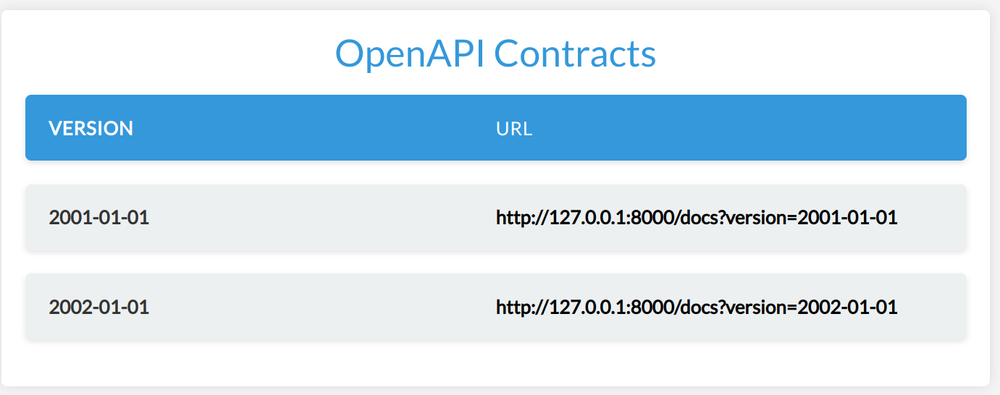

# Going back in time before the breaking change

We need to create a migration to handle changes between these versions. For every endpoint whose `response_model` is `UserResource`, this migration will convert the list of addresses back to a single address when migrating to the previous version. Yes, migrating **back**: you might be used to database migrations where we write upgrade migration and downgrade migration but here our goal is to have an app of HEAD version and to describe what older versions looked like in comparison to it. That way the old versions are frozen in migrations and you can **almost** safely forget about them.

```python
# versions/v2002_01_01.py
from pydantic import Field
from data.head.users import BaseUser, UserCreateRequest, UserResource
from cadwyn.structure import (
    schema,
    VersionChange,
    convert_request_to_next_version_for,
    convert_response_to_previous_version_for,
    RequestInfo,
    ResponseInfo,
)


class ChangeAddressToList(VersionChange):
    description = (
        "Change user address to a list of strings to "
        "allow the user to specify multiple addresses"
    )
    instructions_to_migrate_to_previous_version = (
        # We assume that issubclass(UserCreateRequest, BaseUser) and
        #                issubclass(UserResource, BaseUser)
        schema(BaseUser).field("addresses").didnt_exist,
        schema(BaseUser).field("address").existed_as(type=str, info=Field()),
    )

    @convert_request_to_next_version_for(UserCreateRequest)
    def change_address_to_multiple_items(request: RequestInfo):
        request.body["addresses"] = [request.body.pop("address")]

    @convert_response_to_previous_version_for(UserResource)
    def change_addresses_to_single_item(response: ResponseInfo) -> None:
        response.body["address"] = response.body.pop("addresses")[0]
```

See how we are popping the first address from the list? This is only guaranteed to be possible because we specified earlier that `min_items` for `addresses` must be `1`. If we didn't, then the user would be able to create a user in a newer version that would be impossible to represent in the older version. I.e. If anyone tried to get that user from the older version, they would get a `ResponseValidationError` because the user wouldn't have data for a mandatory `address` field. You need to always keep in mind that API versioning is only for versioning your **API**, your interface. Your versions must still be completely compatible in terms of data. If they are not, then you are versioning your data and you should really go with a separate app instance. Otherwise, your users will have a hard time migrating back and forth between API versions and so many unexpected errors.

See how we added a migration not only for response but also for request? This will allow our business logic to stay completely the same, no matter which version it was called from. Cadwyn will always give your business logic the request model from the HEAD version by wrapping each request in it.

# Grouping Version Changes

Finally, we group the version changes in the `VersionBundle` class.

```python
# versions/__init__.py
from versions.v2002_01_01 import ChangeAddressToList
from cadwyn.structure import Version, VersionBundle
from datetime import date
from data import head


version_bundle = VersionBundle(
    Version(date(2002, 1, 1), ChangeAddressToList),
    Version(date(2001, 1, 1)),
    head_schemas_package=head,
)
```

Let's run code generation, run our app, and then take a look at the generated dashboard and openapi schemas:




The endpoint above is from the `2001-01-01` version. As you see, our routes and business logic are for the HEAD version but our openapi has all information about all API versions which is the main goal of Cadwyn: a large number of long-living API versions without placing any burden on your business logic.

Obviously, this was just a simple example and cadwyn has a lot more features so if you're interested -- take a look at the [how-to](../how_to/index.md) and [concepts](../concepts/index.md) sections.
